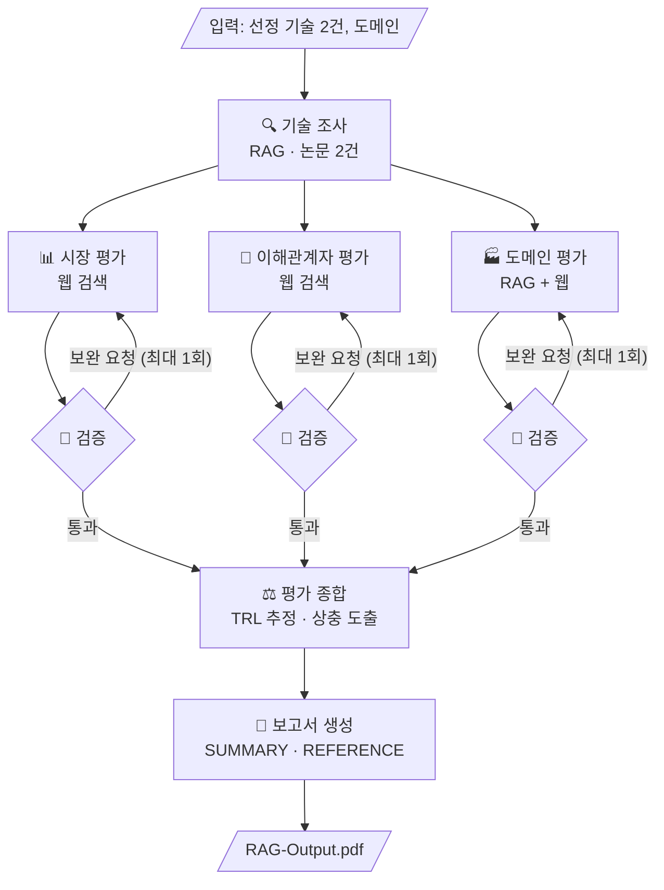

# skala-kv-prism

KV cache 최적화 기술을 소프트웨어(압축)와 하드웨어(메모리 확장) 두 진영에서 하나씩 선정하여,
기술 성숙도 · 시장성 · 이해관계자 · 도메인 관점에서 비교 평가하는 **Agentic RAG** 프로젝트입니다.
우열을 판정하지 않고, 같은 기술이 관점에 따라 어떻게 다르게 읽히는지를 보고서로 만듭니다.

## Overview

- Objective : 하나의 기술을 복수 관점에서 비교 평가하고, 관점 간 상충 지점을 드러내는 보고서 생성
- Method : Multi-Agent (LangGraph, 병렬 fan-out + 검증 루프) + Agentic RAG (논문 원문 검색)
- Domain : 데이터센터 · 클라우드 LLM 서빙 (128K 이상 장문맥 요청이 섞인 멀티테넌트 시나리오)
- Tools : 논문 RAG 검색(`rag_retrieve`), 웹 검색(`web_search`), URL 요약(`fetch_and_summarize`)

## Selected Technologies

| 진영 | 기술 | 출처 | 선정 이유 |
| --- | --- | --- | --- |
| SW | **TurboQuant** | Zandieh et al., arXiv 2504.19874 (ICLR 2026) | 재학습 없이 KV cache를 3~4비트로 줄이는 사후 압축의 가장 순수한 형태. 2026-03 공개 직후 메모리 업계 주가 반응, 애널리스트 반박, vLLM 병합이 3주 안에 이어져 관점별 자료가 가장 풍부하고 서로 엇갈림 |
| HW | **ITME** | SK hynix Memory Systems Research, arXiv 2606.12556 | CXL-Hybrid 메모리 계층으로 KV cache를 옮기는 최신 사례. TurboQuant로 주가가 흔들린 메모리 제조사가 낸 답변이라 두 논문이 한 사건의 양면이 됨. 논문 TRL과 기반 CXL 모듈 TRL이 갈려 "발표와 채택의 시차" 서술에 적합 |

문서 풀은 두 논문 38페이지(한도 200페이지)입니다. 선정 기준표와 후보 6편 채점은 설계 문서에 있습니다.

## Features

- 논문 원문 기반 정보 추출 : PyMuPDF로 추출한 텍스트를 섹션 인지 청킹(800토큰, 겹침 100)하고, 검색 결과에 `[TQ p.7]` 형식의 인용 태그를 붙여 REFERENCE까지 추적
- 언어 라우팅 검색 : 한국어 질의는 bge-m3 dense, 영어 질의는 BM25로 검색. 점수 결합형 하이브리드는 한국어 질의 성능을 떨어뜨려 채택하지 않음
- 웹 검색 · 요약 도구 : 시장 · 이해관계자 근거를 기관명 · 날짜 · URL과 함께 소스 레지스트리에 기록
- 관점별 병렬 평가 : 시장 · 이해관계자 · 도메인 에이전트가 분리된 State 키에 결과를 기록
- TRL 추정 : 논문 TRL과 기반 기술 TRL을 분리하고 "공개 정보 기반 추정" 문구를 항상 붙임
- 확증 편향 방지 전략 : (1) 기술별 긍정 · 부정 근거 각 1건 이상 강제 (2) 생성 모델과 판정 모델 분리 (3) 단일 출처 의존 결론에 "출처 다양성 부족" 표시. 검증 에이전트가 양면 근거와 인용 누락을 검사해 최대 1회 보완 요청
- 재현 모드 : 검색 · LLM 응답을 캐시해 API 키 없이 같은 보고서를 재생성 (`--replay`)

## Tech Stack

- Framework : LangGraph
- LLM/Generator : {GPT version}
- LLM/Judge : {GPT version, Generator와 분리}
- Retrieval : Chroma (dense) + rank_bm25 (영어 질의) - Hit Rate@5 0.917, MRR 0.689 (골든 근거 24문항, 언어 라우팅 기준)
- Embedding : BAAI/bge-m3 (MIT, 최대 입력 8,192토큰). 한국어 질의 Hit@5 0.875 / MRR 0.680으로 Qwen3-Embedding-0.6B(0.667 / 0.507) 대비 우세
- PDF Parser : PyMuPDF (숫자 분리 오류 0건, 표 · 2단 조판 보존 만점, 추출 0.7초)
- Web Search : Tavily
- Environment : Python 3.11, uv (`pyproject.toml` + `uv.lock`)

## Agents

- 🔍 기술 조사 (RAG) : 논문에서 개요 · 메커니즘 · 주장 성능 · 실험 조건 · 저자 명시 한계를 추출하고 TRL용 논문 신호를 기록
- 📊 시장 평가 (웹) : 상용화 · 채택, 생태계 지지를 등급화하고 TRL용 채택 신호(코드 · 프레임워크 통합 · 제품)를 기록
- 🤝 이해관계자 평가 (웹) : 투자 업계와 경쟁 진영(메모리 벤더)의 입장을 긍정 · 부정 · 유보로 병기
- 🏭 도메인 평가 (RAG + 웹) : 서빙 시나리오 3항목(처리량 · 비용, 정확도 리스크, 인프라 전제) 적합성
- 🧐 검증 (Judge) : 양면 근거 유무와 인용 유무 검사, 통과 또는 보완 지시(최대 1회)
- ⚖️ 평가 종합 : TRL 추정, 관점 × 기술 매트릭스, 상충 지점 2개 도출, 중립 요약
- 📝 보고서 생성 : 목차별 작성, SUMMARY 반 페이지 제한, 인용 id로 REFERENCE 생성, Markdown → PDF

## Architecture



- Workflow : 기술 조사 → 관점 평가 → 종합 → 보고서
- Fan-out / Join : 세 관점을 병렬 실행하고 분리된 State 키(`market_eval`, `stakeholder_eval`, `domain_eval`)에 기록
- Loop : 관점 서브그래프 안에서 평가 → 검증 → 보완, 최대 1회
- Branch : 검증 결과에 따른 조건부 엣지 (통과 / 보완 / 재시도 소진)

## Directory Structure

```
├── configs/               # 실행 설정 (모델, 검색 파라미터, 선정 기술)
├── data/
│   ├── papers/            # 문서 풀 PDF (TurboQuant, ITME) — git 제외
│   └── qa/                # 골든 근거 세트 (검색 평가용)
├── src/kvprism/
│   ├── rag/               # 로딩 · 청킹 · 인덱싱 · 언어 라우팅 검색
│   ├── tools/             # web_search, fetch_and_summarize, rag_retrieve, 소스 레지스트리
│   ├── agents/            # 기술 조사 · 시장 · 이해관계자 · 도메인 · 검증 · 종합 · 보고서
│   ├── graph/             # State 스키마, 관점 서브그래프, 메인 그래프
│   └── prompts/           # 에이전트별 프롬프트 템플릿
├── outputs/
│   ├── cache/             # 검색 · LLM 응답 캐시 (재현 모드용)
│   └── index/             # Chroma · BM25 인덱스
├── scripts/               # 인덱싱, 검색 평가, 재현 스크립트
├── tests/
├── docs/                  # 설계 문서, 실험 기록
├── app.py                 # 실행 스크립트
├── pyproject.toml         # 의존성 정의
├── uv.lock                # 팀 공용 환경 잠금
└── README.md
```

## Usage

```bash
uv sync --extra dev        # .venv 생성 + uv.lock 기준으로 동일 환경 설치
cp .env.example .env       # OPENAI_API_KEY, TAVILY_API_KEY 입력
uv run python app.py            # 전체 그래프 실행 → outputs/report.pdf
uv run python app.py --replay   # 캐시로 API 키 없이 재생성
```

## Contributors

- {이름} : Retrieval (문서 로딩 · 청킹, 골든 근거 세트, 임베딩 · 파서 실측, 언어 라우팅 검색, 기술 조사 에이전트)
- {이름} : Graph & State (State 스키마, 관점 서브그래프와 검증 루프, 메인 그래프, 실행 스크립트, 재현 모드)
- {이름} : Web Research (검색 · 요약 도구, 소스 레지스트리, 시장 · 이해관계자 · 도메인 에이전트 프롬프트)
- {이름} : Evaluation & Report (평가 기준표 · TRL 규칙, 종합 · 보고서 생성 에이전트, PDF 변환, 설계 문서)
