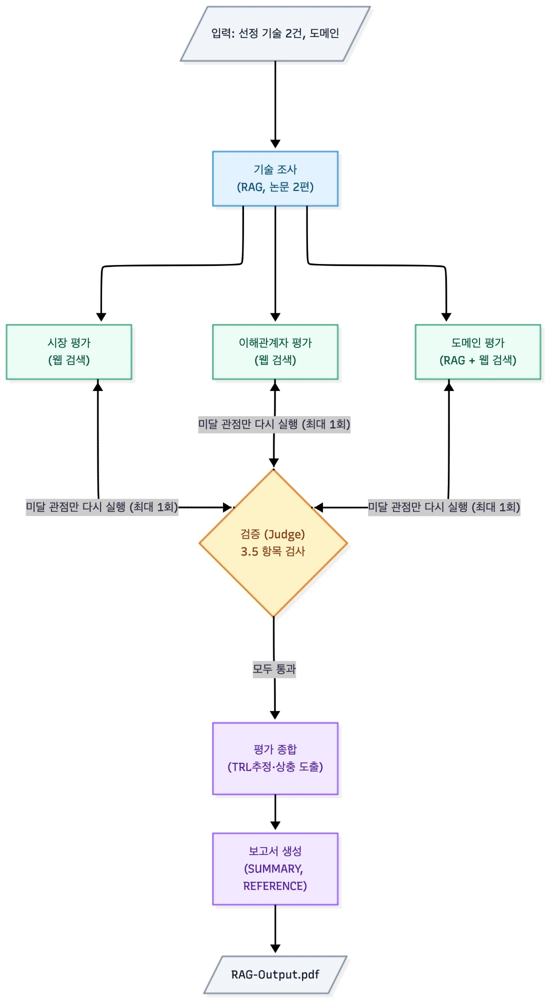

# KV Prism

KV cache 최적화 기술을 소프트웨어(압축) 진영과 하드웨어(메모리 확장) 진영에서 하나씩 골라,
기술 성숙도 · 시장성 · 이해관계자 · 도메인 네 관점에서 비교 평가하는 Multi-Agent + Agentic RAG 프로젝트입니다.

어느 기술이 더 낫다고 판정하지 않습니다. **같은 기술이 관점에 따라 어떻게 다르게 읽히는지**를 근거와 함께 보여주는 것이 목표입니다.

- 산출물 : `outputs/RAG-Output.pdf` (실행할 때마다 새로 생성)
- 실행 : `uv run python app.py`

## 문제 정의

LLM은 앞에서 계산한 Key-Value를 저장해 두고 재사용합니다. 이것이 KV cache입니다. 문맥이 길어질수록 저장량이 그대로 늘어나 GPU 메모리(HBM)를 빠르게 채웁니다. 계산이 병목이던 문제가 **메모리가 병목인 문제로 바뀐 것**입니다.

푸는 방향은 둘입니다.

| 진영 | 방법 | 얻는 것 | 내주는 것 |
| --- | --- | --- | --- |
| SW | 데이터를 작게 만든다 (양자화) | 지금 장비에서 바로 적용 | 정확도가 떨어질 수 있음 |
| HW | 담을 공간을 넓힌다 (메모리 계층) | 정확도 손실 없음 | 새 장비와 전송 지연 |

서로 반대 방향으로 맞바꾸기 때문에 "어느 쪽이 우수한가"에는 답이 없습니다. 논문 성숙도로 보면 둘 다 실험실 단계인데, 시장에서는 한쪽의 기반 기술이 이미 양산 단계이고, 실제 서빙 조건을 넣으면 또 다르게 읽힙니다. 그래서 관점별로 따로 조사하고 **평가가 갈리는 지점 자체를 결과물로** 내놓습니다.

## 우리가 얻고 싶었던 것

1. **근거를 되짚을 수 있는 보고서** — 보고서의 모든 주장이 출처로 이어지고, 그 출처의 원문 발췌가 남아 있어야 합니다
2. **우열 판정이 없는 비교** — 추천이나 우위 표현이 들어가지 않고, 관점 사이의 상충 지점이 드러나야 합니다
3. **한 번 실행으로 재현** — 설정 파일과 명령 하나로 같은 구조의 보고서가 나와야 합니다

## 선정 기술

| 진영 | 기술 | 출처 | 선정 이유 |
| --- | --- | --- | --- |
| SW | **TurboQuant** | Zandieh et al., arXiv 2504.19874 | 모델 구조는 그대로 두고 KV cache의 숫자 표현만 채널당 3.5비트로 줄입니다. 재학습이나 보정이 없어 SW 진영의 접근을 그대로 보여줍니다. 공개 구현, vLLM 통합 제안, 발표 직후의 메모리 업계 반응까지 네 관점 자료가 모두 있습니다 |
| HW | **ITME** | Jang et al., arXiv 2606.12556 | KV cache를 HBM 밖 CXL 메모리 계층으로 옮깁니다. 정확도 손실은 없지만 새 메모리 장치가 필요해 TurboQuant와 반대 방향입니다. 논문은 FPGA 시제품 단계인데 기반 CXL 모듈은 양산 발표가 있어, 논문 성숙도와 기반 기술 성숙도의 차이를 볼 수 있습니다 |

문서 풀은 두 논문 38페이지입니다(한도 200페이지). 후보 6건의 채점표는 설계 문서에 있습니다.

## 우리가 내린 결정

| 항목 | 결정 | 이유 |
| --- | --- | --- |
| 기술 선정 | 사람이 직접 선정 | 에이전트가 고르면 실행마다 대상이 바뀔 수 있고, 고른 뒤 인덱싱해야 해서 시간이 늘어남. 네 관점에 자료가 있는지 보는 일은 사람이 나음 |
| RAG 문서 범위 | 논문 2편으로 한정 | 백서 · 뉴스는 웹 검색으로 가져와 출처와 함께 인용. 논문에서 수치를 뽑는 일과 시장 반응을 찾는 일을 도구로 분리 |
| 검색 방식 | 측정으로 결정 | 질문 24개에 정답 청크를 붙여 파서 · 임베딩 · 검색 방식을 각각 측정. 한국어 질의는 키워드 검색이 거의 못 찾아 영어로 고정 |
| 개발 방식 | State 확정 후 병렬 개발 | 공유 데이터 구조(키 11개)를 첫날 합의. 각자 맡은 노드를 가짜 데이터로 검증하며 개발 |
| 규칙 적용 | 프롬프트 지시가 아니라 코드 검사 | 추천 · 우열 표현, TRL 상한, 인용 형식은 프롬프트만으로는 안 지켜짐. 저장 전에 코드가 검사하고 어긋나면 낮추거나 재요청 |
| 모델 구성 | 생성 모델과 검증 모델 분리 | 같은 모델이 자기 결과를 검사하면 통과 쪽으로 기울어짐 |

## Agents

에이전트 7개가 각각 그래프의 노드 하나입니다. 괄호 안은 코드의 노드 이름입니다. 각 에이전트는 자기가 담당하는 State 키에만 결과를 씁니다.

| 에이전트 | 하는 일 | RAG | 쓰는 키 | 도구 |
| --- | --- | --- | --- | --- |
| 기술 조사 (research) | 논문 2편에서 개요, 동작 방식, 성능 수치와 실험 조건, 한계를 뽑습니다. 검색 결과가 부족하면 질의를 한 번 고쳐 다시 검색합니다 | O | `research`, `sources` | `rag_retrieve` |
| 시장 평가 (market) | 상용화와 채택 사례, 프레임워크 통합 여부를 조사합니다 | X | `market_eval`, `sources` | `web_search` |
| 이해관계자 평가 (stakeholder) | 투자 업계와 경쟁 진영의 입장을 긍정 · 부정 · 유보로 나눠 기록합니다 | X | `stakeholder_eval`, `sources` | `web_search` |
| 도메인 평가 (domain) | 데이터센터 서빙 시나리오에서 처리량 · 비용, 정확도 위험, 인프라 조건을 평가합니다. 논문 실험 조건(RAG)과 도입 사례(웹)를 대조합니다 | O | `domain_eval`, `sources` | `rag_retrieve`, `web_search` |
| 검증 (judge) | 세 관점 결과의 근거 균형과 인용을 검사하고, 미달 관점에 보완 지시를 남깁니다 | X | `judge`, `retry_targets` | Judge LLM |
| 평가 종합 (synthesize) | TRL을 논문 · 기반 기술로 나눠 추정하고, 관점 × 기술 표와 상충 지점을 만듭니다 | X | `synthesis` | 없음 |
| 보고서 생성 (report) | 장별로 본문을 만들고 표와 REFERENCE를 붙여 PDF로 저장합니다 | X | `report` | `render_pdf` |

## Architecture



- 순서 : 기술 조사 → 관점 평가 → 검증 → 종합 → 보고서
- 병렬 : 관점 3개가 동시에 돌고, 셋이 다 끝나면 검증이 한 번 실행됩니다
- 분기 : 검증을 다 통과하면 종합으로, 미달 관점이 있으면 그 관점만 다시 실행합니다
- 반복 : 보완은 최대 1회입니다. 그 뒤에도 남은 문제는 보고서 한계점에 적습니다
- State : 키 11개를 공유합니다. 여러 노드가 함께 쓰는 `sources`만 합치는 규칙을 두고 `source_id` 기준으로 중복을 없앱니다. 나머지 키는 담당 노드가 새 값으로 씁니다. 키별 담당은 [docs/state-contract.md](docs/state-contract.md)에 있습니다

## RAG 파이프라인과 검색 실측

RAG는 기술 조사(research)와 도메인 평가(domain)가 씁니다. 문서 풀은 논문 2편(38쪽), 검색기는 `rag_retrieve(doc_id, query, k)` 하나입니다.

```
PDF ─PyMuPDF→ 페이지 텍스트 ─800자/겹침 100자→ 청크 ─bge-m3→ Chroma ┐
                                                  └─BM25(rank_bm25)─┘→ 순위 융합(RRF) → doc_id 필터 → 상위 5개 + [TQ p.7] 태그
```

- 로딩 : PyMuPDF로 페이지별 텍스트를 뽑습니다. 페이지 번호가 인용 태그가 됩니다
- 청킹 : 800자 단위, 앞뒤 100자 겹침. 청크 id는 `turboquant:p7:2` 형식입니다
- 인덱스 : bge-m3 임베딩은 Chroma에, BM25는 파일로 저장하고 있으면 다시 만들지 않습니다
- 검색 : 질의는 영어로 씁니다. 의미 검색(dense)과 키워드 검색(BM25)이 각각 상위 10개를 내고 순위를 합친 뒤 논문별로 걸러 상위 5개를 돌려줍니다
- 인용 : `Source.url_or_page`에 `[TQ p.7]` 태그, `excerpt`에 청크 원문을 그대로 담습니다

**골든 근거 세트로 실측** — 사람이 만든 질문에 정답 근거를 붙인 세트로 Hit@K(상위 K개 안에 정답이 있는 비율)와 MRR(정답이 나온 순위의 역수 평균)을 잽니다. 개발 세트 24문항으로 고르고, 확정 후 검증 세트 12문항으로 다시 확인했습니다.

파서 비교 (bge-m3 고정, 개발 세트)

| 파서 | 추출 시간 | 숫자 분리 오류 (`45 .29`) | 표 행 보존 | 2단 조판 흐름 | 골든 근거 발견 |
| --- | --- | --- | --- | --- | --- |
| **PyMuPDF** | 0.7초 | 0건 | 6/6 | 5/5 | 24/24 |
| pypdf | 2.5초 | 64건 | 6/6 | 5/5 | 24/24 |
| pdfminer | 5.4초 | 0건 | 1/6 | 5/5 | 21/24 |
| pdfplumber | 8.3초 | 3건 | 2/6 | 0/5 | 13/24 |

pypdf는 검색 품질이 같지만 숫자가 `45 .29`처럼 갈라지는 오류가 64건이라, 수치를 인용하는 기술 조사에는 PyMuPDF를 택했습니다.

임베딩 비교 (dense 단독, 개발 세트 24문항)

| 모델 | 영어 질의 Hit@5 / MRR | 한국어 질의 Hit@5 / MRR | 크기 · 라이선스 |
| --- | --- | --- | --- |
| **BAAI/bge-m3** | 0.833 / 0.648 | 0.833 / 0.692 | 568M · MIT |
| Qwen3-Embedding-0.6B | 0.750 / 0.618 | 0.667 / 0.527 | 0.6B · Apache-2.0 |

후보는 한국어 · 영어 지원, 1B 이하, 상업 이용 가능 라이선스로 좁혔습니다. 리더보드 순위는 기준에서 뺐습니다. 일반 데이터셋 기준이라 이 논문 2편의 조건을 반영하지 않기 때문입니다.

검색 방식 비교 (PyMuPDF · bge-m3 · 벤치마크 6편)

| 검색 방식 | 개발 24문항 Hit@5 / MRR | 검증 12문항 Hit@5 / MRR |
| --- | --- | --- |
| dense(영어) | 20/24 (0.833) / 0.648 | 6/12 (0.500) / 0.455 |
| dense(한국어) | 20/24 (0.833) / 0.692 | 7/12 (0.583) / 0.444 |
| BM25(영어) | 23/24 (0.958) / 0.703 | 7/12 (0.583) / 0.389 |
| BM25(한국어) | 11/24 (0.458) / 0.314 | 1/12 (0.083) / 0.056 |
| **dense(영어)+BM25(영어) 순위 융합 — 채택** | **22/24 (0.917) / 0.727** | 8/12 (0.667) / 0.447 |
| dense(한국어)+BM25(한국어) 순위 융합 | 18/24 (0.750) / 0.449 | 5/12 (0.417) / 0.344 |

운영 조건인 논문별 필터를 걸면 채택 방식은 개발 세트 22/24 (0.917) / 0.727로 같고, 검증 세트는 **10/12 (0.833) / 0.570**입니다. 전체 표는 [docs/retrieval_eval_benchmark.md](docs/retrieval_eval_benchmark.md)와 [docs/retrieval_eval_operational.md](docs/retrieval_eval_operational.md)에 있습니다.

## 평가 기준과 편향 방지

| 관점 | 무엇을 보나 | 기준 |
| --- | --- | --- |
| 기술 성숙도 (TRL) | 논문 기술과 기반 기술을 따로 | 어떤 환경에서 검증됐는지로 단계를 정하고, 근거 출처와 "공개 정보 기반 추정" 문구를 같이 적음 |
| 시장성 | 상용화 · 채택, 생태계 지지 | 프레임워크 통합, 제품 로드맵, 벤더 지원 |
| 이해관계자 | 투자 업계, 경쟁 진영 | 긍정 · 부정 · 유보 입장을 출처와 함께 |
| 도메인 적용 | 처리량 · 비용, 정확도 위험, 인프라 조건 | 논문 실험 조건과 데이터센터 서빙 환경을 대조 |

TRL은 논문만 근거이면 3, 논문 밖 근거가 있으면 4, 병합 · 릴리스 · 적용이 확인된 근거가 있어야 5 이상입니다. 종합 단계에서 코드가 확인하고 근거를 넘는 추정은 낮춥니다. CXL 모듈의 양산 발표가 ITME **논문**의 단계를 올리지 못하도록, 논문 기술과 기반 기술의 근거를 나눠서 각각 계산합니다.

편향 방지 장치는 네 가지입니다.

| 장치 | 방식 |
| --- | --- |
| 근거 균형 | 기술별로 긍정 · 부정 근거가 모두 있는지 확인, 없으면 보완 요청 |
| 인용 검사 | 근거 문장과 출처 발췌문을 Judge LLM에 같이 넣어 뒷받침하는지 판정 |
| 모델 분리 | 생성 모델과 Judge 모델을 분리 |
| 금지 표현 | 추천 · 우열 표현을 종합 결과와 보고서 본문에서 저장 전에 검사 |

## 보고서 구조

목차는 SUMMARY → 1. 분석 배경 → 2. 기술 선정 → 3. 기술 개요 → 4. 관점별 평가 → 5. 시사점 → 6. 한계점 → REFERENCE입니다.

- 장마다 따로 생성합니다. 한 번에 쓰면 장별 분량과 지침이 무너집니다
- SUMMARY는 6개 장을 다 쓴 뒤 그 본문만 보고 마지막에 씁니다. 보고서 소개가 아니라 **이 요약만 읽는 사람을 위한 결론**입니다. A4 반 페이지를 넘으면 저장하지 않습니다
- TRL 표, 관점 × 기술 표, 상충 지점은 모델이 아니라 코드가 조립합니다
- 본문의 논문 인용은 `[TQ p.7]` 형식이고, REFERENCE에는 본문에 실제 인용된 자료만 논문 · 웹 형식에 맞춰 싣습니다
- 장별 생성이 검사에 걸리면 무엇이 틀렸는지 알려주고 한 번 다시 요청합니다

## 실행 결과

2026-09-22 실행, 개발용 모델(gpt-5.6-luna) 기준

| 항목 | 값 |
| --- | --- |
| 실행 시간 | 검증 포함 약 10분, 검증 생략 시 255초 |
| 보고서 | 8페이지, 본문 약 25,000자 |
| 인용 | 본문 인용 284개, REFERENCE 14건(논문 2, 웹 12) |
| 상충 지점 | 3개 |

TRL 추정 결과입니다.

| 기술 | 논문 기술 | 기반 기술 |
| --- | --- | --- |
| TurboQuant | 3 | 7 |
| ITME | 3 | 3 |

두 논문 모두 논문 안의 실험 · 시제품 단계라 3입니다. 차이는 기반 기술에서 납니다.

관점이 갈린 지점은 세 개가 나왔습니다.

| 상충 지점 | 쉽게 말하면 |
| --- | --- |
| 1. KV 용량 절감 vs 추론 품질 · 역양자화 비용 (TurboQuant) | 논문은 3.5비트까지 줄여도 품질이 그대로라고 합니다. 그런데 vLLM에서 실제로 돌려본 분석은 더 세게 줄이면 정확도가 최대 20점 떨어지고, 압축을 되돌리는 계산 때문에 느려진다고 합니다. 줄인 쪽의 결과와 돌려본 쪽의 결과가 다릅니다 |
| 2. 원격 메모리 용량 확장 vs HBM 지연 · 대역폭 (ITME) | ITME는 GPU 밖 메모리로 용량을 크게 늘립니다. 하지만 GPU에 붙은 메모리(HBM)가 훨씬 빠릅니다. 용량을 얻는 대신 속도를 내주는 구조라, 용량이 급한 서비스와 속도가 급한 서비스가 다르게 평가합니다 |
| 3. 압축이 메모리 수요를 줄이나, 옮기나 (시장) | TurboQuant 공개 직후 "메모리가 덜 필요해진다"는 걱정으로 메모리 반도체 주가가 내렸습니다. 같은 보도는 데이터를 옮기는 병목이 커지면 오히려 HBM과 CXL 같은 고성능 메모리 수요가 늘 수 있다고도 봅니다. 압축이 수요를 줄이는지 다른 곳으로 옮기는지 해석이 갈립니다 |

보고서 5장은 두 기술을 "같은 병목을 다루지만 TurboQuant는 저장 밀도를, ITME는 계층 간 데이터 이동을 다루는 보완 관계"로 정리했고, 병용 조건으로 압축된 KV 블록을 ITME의 원격 계층에 두는 구성을 제시했습니다. 어느 쪽도 추천하지 않습니다.

## 한계

실제 생성된 보고서와 실행 기록 기준

**검증이 세 관점을 모두 미달 처리했습니다.** 보완 1회 뒤에도 같은 판정이었습니다. 관점 평가가 근거 문장을 한국어로 요약해서 쓰는데, Judge는 출처 원문과 대조합니다. 재실행으로 고쳐질 문제가 아니라 근거 문장을 원문 그대로 옮기게 하는 프롬프트 수정이 필요합니다. 보고서 6장에 "일부 인용 검증이 통과하지 않았다"로 기록됩니다.

**TRL 상태 단어 검사를 모델이 우회했습니다.** TurboQuant 기반 기술 7은 "병합 · 배포 · 릴리스 신호가 확인된다"처럼 요구된 단어를 한 줄에 나열한 근거로 통과한 값입니다. 단어 포함 여부만 보는 검사의 한계입니다.

**관점 × 기술 표가 요약이 아닙니다.** 4장 본문 3,200자에 표가 3,050자로 분량이 같습니다. 표 칸의 분량 제한이 프롬프트에 없었습니다.

**온디바이스 환경은 다루지 않습니다.** 설계 단계에서 CXL 방식과 직접 비교가 어려워 평가 범위에서 뺐습니다. 도메인 평가 프롬프트에는 남아 있어 정리가 필요합니다.

**출처 추적은 페이지까지입니다.** 어떤 청크의 어떤 문장이 쓰였는지는 보고서에서 보이지 않습니다. 원문 발췌는 실행 중 State에만 남습니다.

**설계와 다른 부분** — `fetch_and_summarize` 도구는 호출되지 않고, Judge의 인용 검사가 코드 대조 없이 LLM 판정만으로 이뤄집니다.

## Lessons Learned

| 배운 것 | 근거 |
| --- | --- |
| 규칙은 프롬프트가 아니라 코드에 | 프롬프트만 있을 때는 추천 표현과 근거 없는 TRL이 들어감. 코드 검사 후 모델이 매긴 TRL 5가 근거 부족으로 4로 내려간 사례 확인. 반대로 단어 포함만 보는 느슨한 검사는 우회당함(기반 기술 7) |
| 모델 성능이 형식 준수를 좌우 | 같은 코드에서 gpt-4o-mini는 인용 형식 오류로 재시도 포함 2회 실패, gpt-4o는 0건. 강한 모델도 12자리 난수 ID에서 한 글자를 빠뜨린 사례 1건 → 재요청 1회 추가 |
| 구조화 출력의 줄바꿈은 신뢰 불가 | 두 줄로 요구한 TRL 근거를 모델이 한 줄로 이어 씀. 줄 단위 파싱을 라벨 위치 파싱으로 변경 |
| 영어 논문에는 영어 질의 | 한국어 질의 BM25 Hit@5 0.458, 영어 0.958. 융합 후 MRR도 한국어 0.449, 영어 0.727 |
| 검증 비용은 근거 수에 비례 | Judge가 근거마다 LLM을 호출해 200초, 전체 실행의 70%. 재실행까지 더하면 380초 |
| State 선확정이 병렬 개발의 조건 | 키 11개를 먼저 합의하고 4명이 노드 7개를 각자 가짜 데이터로 검증하며 개발 |

## Tech Stack

- Framework : LangGraph
- LLM/Generator : gpt-5.6-terra (조사 · 관점 평가는 reasoning effort low, 종합 · 보고서는 medium). 개발 중에는 gpt-5.6-luna
- LLM/Judge : gpt-5.6-luna (reasoning effort none, temperature 0)
- Retrieval : Chroma(dense) + rank_bm25, 순위 융합. 개발 세트 Hit@5 0.917 / MRR 0.727, 검증 세트 10/12 (0.833) / 0.570
- Embedding : BAAI/bge-m3 (568M, MIT)
- PDF Parser : PyMuPDF
- Web Search : Tavily
- Report : markdown-pdf
- Tracing : LangSmith
- Environment : Python 3.11, uv

## Directory Structure

```
├── app.py                 # 실행 진입점
├── configs/
│   ├── pipeline.yaml      # 실행 입력 (도메인, 시나리오, 기술 2건)
│   └── rag.yaml           # 청킹 · 검색 설정, 논문 서지 정보
├── data/
│   ├── papers/            # 문서 풀 PDF — git 제외
│   └── qa/                # 골든 근거 세트 dev.json(24) · val.json(12)
├── src/kvprism/
│   ├── rag/               # 로딩 · 청킹 · 인덱싱 · 검색
│   ├── tools/             # rag_retrieve · web_search · render_pdf
│   ├── agents/            # 에이전트 7개와 보고서 규칙
│   ├── graph/             # State 정의와 그래프 조립
│   └── prompts/           # 에이전트별 프롬프트
├── outputs/
│   ├── index/             # 인덱스 (첫 실행 때 생성)
│   ├── cache/             # 웹 검색 캐시
│   ├── report.md          # 보고서 본문
│   └── RAG-Output.pdf     # 최종 산출물
├── scripts/               # 논문 내려받기 · 인덱스 생성 · 검색 측정
├── tests/
└── docs/                  # State 계약 · 검색 실측 기록
```

## Usage

```bash
uv sync                                    # 환경 설치
cp .env.example .env                       # OPENAI_API_KEY, TAVILY_API_KEY, 모델 이름
uv run python scripts/download_papers.py   # 논문 PDF 2편
uv run python app.py                       # 전체 실행 → outputs/RAG-Output.pdf
```

검색 품질과 테스트를 따로 확인하려면:

```bash
uv run python scripts/build_index.py                 # 인덱스 생성
uv run python scripts/eval_retrieval.py --benchmark  # 후보 6편, 개발 24 · 검증 12문항
uv run pytest                                        # 단위 테스트
```

## Contributors

- 이진욱 : RAG 파이프라인 · 기술 조사 (PDF 로딩 · 청킹 · 인덱싱, `rag_retrieve`, `research` 노드, 골든 근거 세트와 파서 · 임베딩 · 검색 방식 실측)
- 이민경 : 웹 도구 · 관점 평가 (`web_search`, 검색 결과 캐싱, `market` · `stakeholder` · `domain` 노드와 프롬프트)
- 정유정 : 오케스트레이션 · 검증 (공용 State 스키마, LangGraph 병렬 실행과 재실행 루프, `judge` 노드, `app.py`)
- 오승민 : 평가 종합 · 보고서 (`synthesize` 노드의 TRL 추정과 상충 지점, `report` 노드의 장별 생성과 REFERENCE, 금지 표현 검사, PDF 변환)
