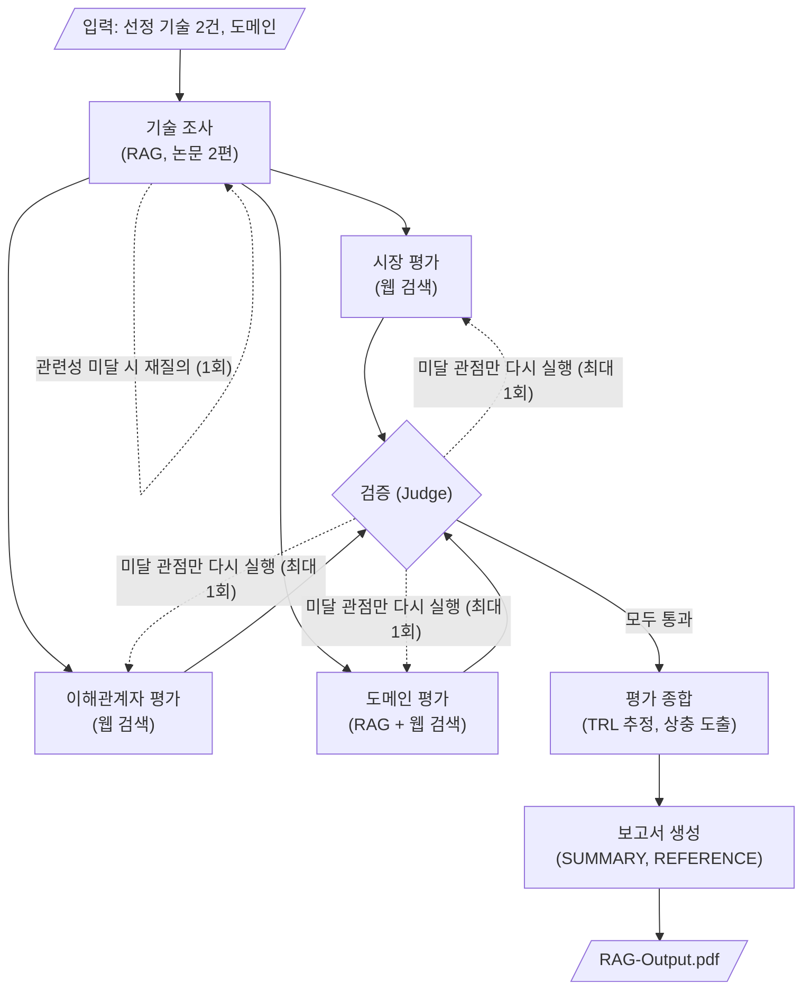

# skala-kv-prism

KV cache 최적화 기술을 소프트웨어(압축)와 하드웨어(메모리 확장) 두 진영에서 하나씩 선정하여,
기술 성숙도 · 시장성 · 이해관계자 · 도메인 관점에서 비교 평가하는 **Agentic RAG** 프로젝트입니다.
우열을 판정하지 않고, 같은 기술이 관점에 따라 어떻게 다르게 읽히는지를 보고서로 만듭니다.

## Overview

- Objective : 하나의 기술을 복수 관점에서 비교 평가하고, 관점 간 상충 지점을 드러내는 보고서 생성
- Method : Multi-Agent (LangGraph, 관점 3개 병렬 실행 + 검증 1회) + Agentic RAG (논문 원문 검색)
- Domain : 데이터센터 · 클라우드 LLM 서빙 (장문맥 요청이 섞인 멀티테넌트 시나리오)
- Tools : 논문 RAG 검색(`rag_retrieve`), 웹 검색(`web_search`), URL 요약(`fetch_and_summarize`)

## Selected Technologies

| 진영 | 기술 | 출처 | 선정 이유 |
| --- | --- | --- | --- |
| SW | **TurboQuant** | Zandieh et al., arXiv 2504.19874 | 모델 구조는 그대로 두고 KV cache의 숫자 표현만 채널당 3.5비트로 줄인다. 재학습과 보정이 필요 없어 SW 진영의 접근을 그대로 보여준다. 공개 구현, vLLM 통합, 발표 직후의 메모리 업계 반응까지 네 관점 자료가 모두 있다 |
| HW | **ITME** | Jang et al., arXiv 2606.12556 | KV cache를 HBM 밖 CXL-Hybrid 메모리 계층으로 옮긴다. 정확도 손실은 없지만 새 메모리 장치가 필요해 TurboQuant와 반대 방향의 맞바꿈이 된다. 논문은 FPGA 프로토타입 단계이고 기반 CXL 모듈은 제품과 양산 발표가 있어, 논문 성숙도와 기반 기술 성숙도의 차이를 볼 수 있다 |

문서 풀은 두 논문 38페이지(한도 200페이지)입니다. 선정 기준표와 후보 6건 채점은 설계 문서에 있습니다.

## Features

- 논문 원문 기반 정보 추출 : PyMuPDF로 본문과 표를 추출하고 800자 단위(앞뒤 100자 겹침)로 청킹합니다. 검색 결과에 `[TQ p.7]` 형식의 태그를 붙여 REFERENCE까지 추적합니다
- 영어 질의 + 순위 융합 검색 : dense(bge-m3)와 BM25의 검색 순위를 융합하고 기술별 doc_id로 걸러 상위 5개를 돌려줍니다. 문서가 영어 논문이라 한국어 질의는 BM25가 정답을 거의 찾지 못해, 검색 질의는 영어로 고정합니다
- 검색 재질의 : 기술 조사 에이전트가 검색 결과로 질문에 답할 수 있는지 판정하고, 부족하면 질의를 한 번 고쳐 다시 검색합니다
- 관점별 병렬 평가 : 시장 · 이해관계자 · 도메인 에이전트가 분리된 State 키에 결과를 기록합니다
- 원문 발췌 보관 : 도구가 가져온 원문 일부를 요약 없이 Source의 excerpt에 남기고, 근거 문장은 excerpt에서 그대로 옮긴 문장만 사용합니다
- 확증 편향 방지 : 기술별로 긍정 · 부정 근거를 각 1건 이상 두고, 생성 모델과 판정 모델을 분리하며, 단일 출처에만 기댄 결론에는 표시를 남깁니다
- 검증 : 근거 균형, 인용 포함 여부, 출처 다양성, 금지 표현은 코드로 검사하고, 근거가 주장을 뒷받침하는지는 Judge LLM이 판정합니다. 미달 관점만 최대 1회 다시 실행합니다
- TRL 추정 : 논문 TRL과 기반 기술 TRL을 나누어 추정하고, 근거 source_id와 "공개 정보 기반 추정" 문구를 함께 기록합니다

## Tech Stack

- Framework : LangGraph
- LLM/Generator : gpt-5.6-terra (조사 · 관점 평가는 reasoning effort low, 종합 · 보고서 생성은 medium). 개발 중에는 비용을 줄이려고 gpt-5.6-luna로 실행
- LLM/Judge : gpt-5.6-luna (reasoning effort none, temperature 0). 자기 검증 편향을 줄이려고 Generator와 분리
- Retrieval : Chroma(dense) + rank_bm25 순위 융합, 영어 질의 - 개발 세트 Hit@5 0.917 / MRR 0.727, 검증 세트 Hit@5 10/12
- Embedding : BAAI/bge-m3 (568M, MIT, 최대 입력 8,192토큰). dense 단독 Hit@5 0.833 / MRR 0.670으로 Qwen3-Embedding-0.6B(0.708 / 0.572)보다 앞섬
- PDF Parser : PyMuPDF (숫자 분리 오류 0건, 표 6/6과 2단 조판 5/5 보존, 추출 0.7초)
- Web Search : Tavily
- Report : markdown-pdf
- Environment : Python 3.11, uv (`pyproject.toml` + `uv.lock`)

## RAG 아키텍처 및 검색 실측

RAG는 기술 조사(research)와 도메인 평가(domain) 에이전트가 씁니다. 문서 풀은 선정 논문 2편(38쪽)이고, 검색기는 `rag_retrieve(doc_id, query, k)` 하나입니다.

```
PDF ─PyMuPDF→ 페이지 텍스트 ─800자/겹침 100자→ 청크 ─bge-m3→ Chroma ┐
                                                  └─BM25(rank_bm25)─┘→ RRF(k=60) → doc_id 필터 → 상위 5개 + [TQ p.7] 태그
```

- 로딩 : PyMuPDF로 페이지별 텍스트를 뽑고 NFKC 정규화, 줄 끝 하이픈 복원만 합니다. 페이지 번호가 인용 태그가 됩니다
- 청킹 : 페이지 안에서 800자 단위, 앞뒤 100자 겹침. 청크 id는 `turboquant:p7:2` 형식이고 그대로 `Source.source_id`가 됩니다
- 인덱스 : bge-m3 임베딩은 Chroma(`outputs/index/chroma`), BM25는 pickle로 저장하고 있으면 다시 만들지 않습니다
- 검색 : 질의는 영어로 씁니다. dense와 BM25가 각각 상위 10개를 내고 RRF로 융합한 뒤 doc_id로 걸러 상위 5개를 돌려줍니다
- 인용 : 반환된 `Source`의 `url_or_page`에 `[TQ p.7]` 태그, `excerpt`에 청크 원문을 그대로 담습니다. 검증 노드가 근거 문장 포함 여부를 이 원문에서 확인합니다

**골든 근거 세트로 실측** — 사람이 만든 질문에 정답 근거(정규식)를 붙인 세트로 Hit@K(상위 K 안에 정답 청크가 있는 비율)와 MRR@10을 잽니다. 개발 세트 24문항으로 파서·임베딩·검색 방식을 고르고, 확정 후 검증 세트 12문항으로 한 번 더 확인했습니다. 문항마다 영어·한국어 질의를 하나씩 두었습니다. 설계 단계 벤치마크는 후보 논문 6편(136쪽, 728청크)에서 쟀고, 운영 인덱스(2편)에서도 같은 코드로 다시 쟀습니다. 검색 방식 표와 운영 인덱스 재측정은 `scripts/eval_retrieval.py`가 현재 코드로 다시 계산한 값이고, 파서·임베딩 비교표는 설계 단계 실험값입니다.

파서 비교 (bge-m3 고정, 개발 세트)

| 파서 | 추출 시간 | 숫자 분리 오류 (`45 .29`) | 표 행 보존 | 2단 조판 흐름 | 골든 근거 발견 |
| --- | --- | --- | --- | --- | --- |
| **PyMuPDF** | 0.7초 | 0건 | 6/6 | 5/5 | 24/24 |
| pypdf | 2.5초 | 64건 | 6/6 | 5/5 | 24/24 |
| pdfminer | 5.4초 | 0건 | 1/6 | 5/5 | 21/24 |
| pdfplumber | 8.3초 | 3건 | 2/6 | 0/5 | 13/24 |

pypdf는 검색 품질이 같지만 수치를 인용하는 기술 조사에 숫자 분리 보정이 더 필요해 PyMuPDF를 택했습니다.

임베딩 비교 (dense 단독, doc_id 필터 없음, 개발 세트 24문항)

| 모델 | 영어 질의 Hit@5 / MRR | 한국어 질의 Hit@5 / MRR | 크기 · 라이선스 |
| --- | --- | --- | --- |
| **BAAI/bge-m3** | 0.833 / 0.648 | 0.833 / 0.692 | 568M · MIT |
| Qwen3-Embedding-0.6B | 0.750 / 0.618 | 0.667 / 0.527 | 0.6B · Apache-2.0 |

후보는 한국어·영어 지원, 1B 이하, 상업 이용 가능 라이선스로 좁혔고, 리더보드 순위는 기준에서 뺐습니다. 리더보드는 일반 데이터셋 기준이라 이 논문 2편과 질의 조건을 반영하지 않기 때문입니다.

검색 방식 비교 (PyMuPDF · bge-m3 · 벤치마크 6편, 설계서 2.2.2와 같은 조건)

| 검색 방식 | 개발 24문항 Hit@5 / MRR | 검증 12문항 Hit@5 / MRR |
| --- | --- | --- |
| dense(영어) | 20/24 (0.833) / 0.648 | 6/12 (0.500) / 0.455 |
| dense(한국어) | 20/24 (0.833) / 0.692 | 7/12 (0.583) / 0.444 |
| BM25(영어) | 23/24 (0.958) / 0.703 | 7/12 (0.583) / 0.389 |
| BM25(한국어) | 11/24 (0.458) / 0.314 | 1/12 (0.083) / 0.056 |
| **RRF dense(영어)+BM25(영어) — 채택** | **22/24 (0.917) / 0.727** | 8/12 (0.667) / 0.447 |
| RRF dense(한국어)+BM25(한국어) | 18/24 (0.750) / 0.449 | 5/12 (0.417) / 0.344 |

운영 조건인 기술별 doc_id 필터를 걸면 채택 방식은 개발 세트 22/24 (0.917) / 0.727로 같고, 검증 세트는 **10/12 (0.833) / 0.570**입니다. 두 조건의 전체 표는 [docs/retrieval_eval_benchmark.md](docs/retrieval_eval_benchmark.md)에 있습니다.

문서가 영어 논문이라 한국어 질의는 BM25가 정답을 거의 찾지 못하고, dense와 융합해도 dense 단독보다 떨어집니다. 영어 질의로 dense와 BM25를 융합하면 두 세트 모두에서 MRR이 가장 높아 이 방식을 채택했습니다. 실험의 영어 질의는 사람이 쓴 것이라 LLM이 쓴 질의는 이보다 낮을 수 있고, 그래서 기술 조사 에이전트는 검색 결과의 관련성을 판정해 부족하면 질의를 한 번 고쳐 다시 검색합니다.

운영 인덱스(선정 2편, 해당 논문 문항만) 재측정 — 채택 방식 기준 개발 8문항 6/8 (MRR 0.641), 검증 4문항 4/4 (MRR 0.708). 문항 수가 적어 한 문항이 12.5%p를 움직이므로 참고값입니다. 전체 표는 [docs/retrieval_eval_operational.md](docs/retrieval_eval_operational.md)에 있습니다.

## Agents

에이전트 7개가 각각 그래프의 노드 하나입니다. 괄호 안은 코드에서 쓰는 노드 이름입니다.

- 기술 조사 (research) : 논문 2편에서 핵심 아이디어, 동작 방식, 성능 수치와 실험 조건, 저자가 밝힌 한계를 추출하고 TRL용 논문 신호를 기록합니다. 근거 청크가 없는 수치는 쓰지 않습니다
- 시장 평가 (market) : 상용화 · 채택 사례와 생태계 지지를 조사하고 TRL용 채택 신호(공개 코드, 프레임워크 통합, 제품 출시)를 기록합니다
- 이해관계자 평가 (stakeholder) : 투자 업계와 경쟁 진영의 입장을 긍정 · 부정 · 유보로 나누어 출처와 함께 기록합니다
- 도메인 평가 (domain) : 서빙 시나리오 3항목(처리량 · 비용, 정확도 리스크, 인프라 전제) 적합성을 논문 실험 조건과 대조해 평가합니다
- 검증 (judge) : 관점 3개의 결과를 한 번에 검사하고, 미달 관점에 보완 지시를 남깁니다. 보완은 1회까지입니다
- 평가 종합 (synthesize) : TRL을 추정하고 관점 × 기술 매트릭스와 상충 지점 2개 이상을 정리합니다
- 보고서 생성 (report) : 장별로 본문을 만들고, 인용 태그를 모아 REFERENCE를 만든 뒤 PDF로 변환합니다

## Architecture



- Workflow : 기술 조사 → 관점 평가 → 검증 → 종합 → 보고서
- Fan-out / Fan-in : 관점 3개가 병렬로 실행되고, 셋이 모두 끝나면 검증이 한 번 실행됩니다
- Branch : 검증 결과가 모두 통과이면 종합으로, 미달 관점이 있으면 그 관점만 다시 실행합니다
- Loop : 보완은 최대 1회이며 retry_count로 횟수를 셉니다. 기술 조사의 재질의는 노드 안에서 처리합니다
- State : 키 11개를 공유하고, 여러 에이전트가 함께 쓰는 sources만 목록으로 이어 붙입니다. 나머지 키는 새 값으로 덮어씁니다

## Directory Structure

```
├── configs/
│   └── rag.yaml           # 청킹 · 검색 파라미터, 논문 메타데이터(인용 태그, 저자, 발행일)
├── data/
│   ├── papers/            # 문서 풀 PDF (TurboQuant, ITME) — git 제외
│   │   └── eval/          # 검색 벤치마크용 후보 6편 — git 제외
│   └── qa/                # 골든 근거 세트 dev.json(24) · val.json(12)
├── src/kvprism/
│   ├── rag/               # 로딩 · 청킹 · 인덱싱 · 순위 융합 검색
│   ├── tools/             # rag_retrieve · web_search · fetch_and_summarize
│   ├── agents/            # 에이전트 7개
│   ├── graph/             # State 정의와 그래프 조립
│   └── prompts/           # 에이전트별 프롬프트
├── outputs/
│   └── index/             # Chroma · BM25 인덱스 (첫 실행 때 자동 생성)
├── scripts/
│   ├── download_papers.py # arXiv에서 논문 PDF 내려받기
│   ├── build_index.py     # 인덱스 생성 (--eval: 벤치마크 코퍼스)
│   └── eval_retrieval.py  # Hit@K · MRR 측정 (--benchmark: 6편 24/12문항)
├── tests/
└── docs/                  # 설계 문서 · 실험 기록
```

## Usage

```bash
uv sync                    # .venv 생성 + uv.lock 기준으로 동일 환경 설치 (pytest 포함)
cp .env.example .env       # OPENAI_API_KEY, TAVILY_API_KEY, 모델 이름 입력
uv run python scripts/download_papers.py   # 논문 PDF 2편 내려받기 (--all: 벤치마크용 6편까지)
uv run python app.py       # 전체 그래프 실행 → PDF 생성 (인덱스가 없으면 먼저 만듭니다)
```

검색 품질만 따로 확인하려면:

```bash
uv run python scripts/build_index.py                     # outputs/index 생성 (있으면 건너뜀)
uv run python scripts/eval_retrieval.py                  # 운영 인덱스 2편, 해당 문항 8/4개
uv run python scripts/eval_retrieval.py --benchmark      # 후보 6편, 개발 24 · 검증 12문항 (설계 문서 조건)
uv run pytest tests/test_agents.py -v -s                 # 관점 평가 노드 스키마 및 실행 검증
uv run pytest                                            # 단위 테스트
```

## Contributors

- 이진욱 : RAG (문서 로딩 · 청킹 · 인덱스, `rag_retrieve`, 기술 조사 에이전트, 골든 근거 세트 · 파서 · 임베딩 · 검색 방식 실측, 검색 평가 스크립트)
- 이민경 : 웹 도구와 관점 평가 (`web_search`, `fetch_and_summarize`, 시장 · 이해관계자 · 도메인 에이전트와 프롬프트)
- 정유정 : State · 그래프 · 검증 (State 정의, 그래프 조립, 검증 에이전트, 실행 스크립트)
- 오승민 : 종합 · 보고서 (평가 종합 · 보고서 생성 에이전트, 금지 표현 규칙, REFERENCE, PDF 변환)