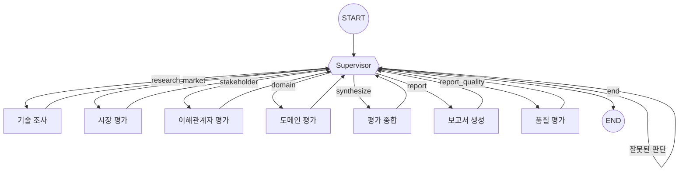
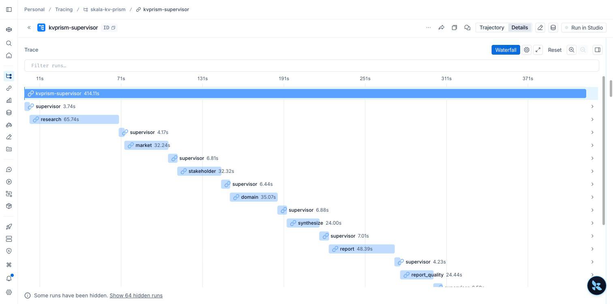
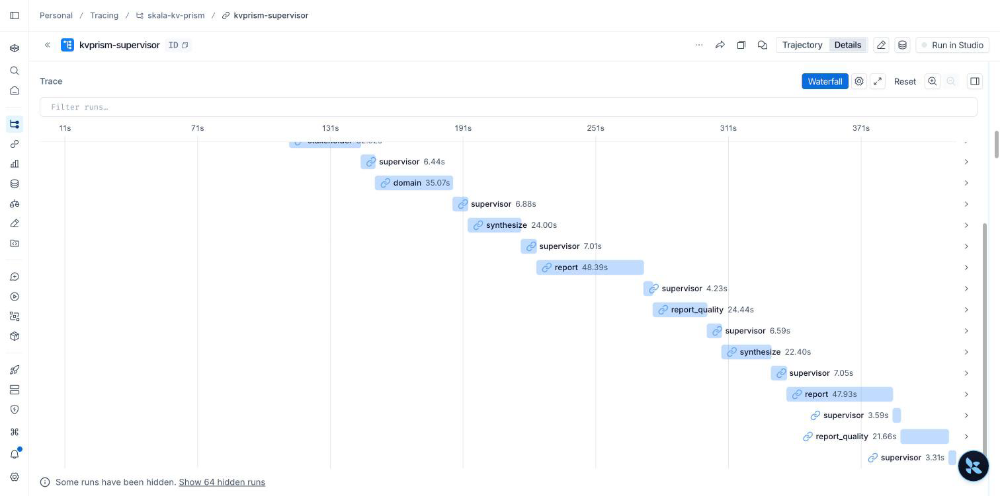

# KV Prism

본 프로젝트는 KV cache 최적화 기술을 소프트웨어(압축) 진영과 하드웨어(메모리 확장) 진영에서 하나씩 선정하여,
기술 성숙도 · 시장성 · 이해관계자 · 도메인 관점에서 평가하는 **Supervisor 패턴** 기반 Multi-Agent 프로젝트입니다.

어느 기술이 더 낫다고 판정하지 않습니다. **같은 기술이 관점에 따라 어떻게 다르게 읽히는지**를 근거와 함께 보여주는 것이 목표입니다.

- 산출물 : `outputs/RAG-OUTPUT.pdf` (품질 평가를 통과한 실행만 게시)
- 실행 : `uv run python app.py`
- 실행 기록 : `outputs/runs/{trace_id}/`

## Overview

- Objective : 하나의 기술을 네 관점에서 비교 평가하고, 관점 사이에 평가가 갈리는 지점을 근거와 함께 정리합니다
- Pattern : **Supervisor** — 기술 2개 × 관점 4개로 할 일이 고정되어 있어 계획을 세워 작업을 나눌 필요가 작습니다. 결과물의 품질은 "근거가 충분한가"와 "품질이 미달이면 어디를 고치는가"에서 갈리므로, 결과가 올 때마다 판단하는 Supervisor를 골랐습니다
- 동적 처리 : 실행 순서를 코드에 두지 않습니다. Supervisor가 매 단계 State를 읽고 다음 작업을 고르며, 근거가 부족하면 해당 에이전트에 보완 지시와 함께 다시 맡깁니다. 보고서는 Supervisor가 근거 충분 판정을 내린 뒤에만 쓰고, 품질 평가가 미달이면 되돌아갈 곳을 다시 정합니다

RAG 단계에서 바뀐 점은 다음과 같습니다.

| 항목 | RAG 단계 | Agent 단계 |
| --- | --- | --- |
| 흐름 | 기술 조사 → 관점 3개 병렬 → 검증 → 종합 → 보고서, 순서 고정 | Supervisor가 State를 보고 다음 작업을 고름 |
| 재작업 | 검증(judge) 미달 관점만 1회 고정 재실행 | Supervisor가 근거 부족을 판단해 해당 에이전트에 보완 지시와 함께 다시 맡김 |
| 보고서 이후 | 없음 | 품질 평가 노드. 미달이면 Supervisor가 되돌아갈 곳을 정함 |
| 종료 | 그래프 끝까지 가면 종료 | 성공 · 미완료 · 실패 세 상태와 실행 상한 |
| 복구 | 없음 | SQLite 체크포인트, `--resume`으로 재개 |

| 기준 | Supervisor | Orchestrator-Workers |
| --- | --- | --- |
| 작업 나누기 | 하위 에이전트는 정해져 있고, 순서와 반복을 동적으로 정함 | 계획을 세워 작업을 동적으로 나눔 |
| 핵심 판단 | 근거가 충분한가, 어디를 다시 할까 | 무엇을 몇 개로 나눌까 |
| 비용 | 단계마다 Supervisor LLM 호출, 순차라 느림 | 병렬이라 빠름 |

RAG 단계에서 병렬이던 관점 3개가 순차로 바뀌어 실행 시간이 늘고, 실행마다 경로가 달라집니다. 이 범위는 코드의 상한 · 하한(가드레일)으로 묶습니다.

## Selected Technologies

- SW : **TurboQuant** (Zandieh et al., arXiv 2504.19874) — 모델 구조는 그대로 두고 KV cache의 숫자 표현만 채널당 3.5비트로 줄입니다. 재학습이나 보정이 없어 "데이터를 작게 만드는" SW 진영의 접근을 그대로 보여줍니다
- HW : **ITME** (Jang et al., arXiv 2606.12556) — KV cache를 HBM 밖 CXL 메모리 계층으로 옮깁니다. 논문은 FPGA 시제품 단계인데 기반 CXL 모듈은 양산 발표가 있어, 논문 성숙도와 기반 기술 성숙도의 차이를 볼 수 있습니다

## Features

- **PDF 자료 기반 정보 추출** : 논문 2편(38쪽)을 RAG로 검색해 개요, 동작 방식, 성능 수치와 실험 조건, 한계를 뽑습니다. 인용한 수치가 원문 발췌에 없으면 코드가 그 주장을 뺍니다
- **웹 검색 기반 관점 평가** : 시장 · 이해관계자 · 도메인을 웹 검색(Tavily)으로 조사하고, 검색 결과의 원문 발췌를 출처와 함께 저장합니다
- **Supervisor 동적 라우팅과 재작업** : 다음 작업, 이유, 보완 지시, 근거 충분성을 LLM이 정하고, 코드는 선택지와 상한만 막습니다
- **확증 편향 방지 전략**
  - 관점 결과를 긍정 · 부정 · 유보 근거로 나눠 기록합니다
  - 반대 자료가 없으면 지어내지 않고 "확인되지 않음"으로 한계를 밝힙니다
  - 등록된 출처 ID만 인용할 수 있고, 저장 전에 코드가 검사합니다
  - 논문 기술의 채택과 기반 기술(CXL 부품 등)의 채택을 구분하고, 논문만 근거이면 TRL 3을 넘지 못하게 코드가 막습니다
  - 추천 · 우열 표현은 종합 결과와 보고서 본문에서 저장 전에 코드가 검사합니다
  - 생성과 판정을 다른 노드와 프롬프트로 나누고, 판정 모델은 `JUDGE_MODEL`로 따로 지정합니다
- **보고서 품질 평가** : 보고서를 만든 뒤 근거성 · 중립성 · 편향 통제 · 관점 커버리지 · 형식을 코드 검사와 Judge LLM으로 판정합니다. 미달이면 Supervisor가 조사 · 종합 · 보고서 중 고칠 곳을 고릅니다
- **중단 후 재개** : 체크포인트에서 미완료 실행을 이어 갑니다

## Tech Stack

- Framework : LangGraph (`StateGraph`, `add_conditional_edges`, SQLite 체크포인트)
- LLM/Supervisor : gpt-5.6-terra (`SUPERVISOR_MODEL`, 비어 있으면 `GENERATOR_MODEL`)
- LLM/Generator : gpt-5.6-terra (`GENERATOR_MODEL`). 개발 중에는 gpt-5.6-luna
- LLM/Judge : gpt-5.6-luna (`JUDGE_MODEL`)
- Retrieval : Chroma(dense) + rank_bm25 순위 융합 — 개발 세트 Hit@5 0.917 / MRR 0.727, 검증 세트 Hit@5 0.833 / MRR 0.570
- Embedding : BAAI/bge-m3 (568M, MIT)
- PDF Parser : PyMuPDF
- Web Search : Tavily
- Report : markdown-pdf, PyMuPDF
- Tracing : LangSmith
- Environment : Python 3.11, uv

## Agents

Supervisor 1개와 하위 에이전트 7개가 각각 그래프의 노드 하나입니다. 괄호 안은 코드의 노드 이름입니다. 하위 에이전트는 자기 결과 키만 돌려주고 Supervisor로 돌아갑니다. 하위 에이전트끼리는 연결하지 않습니다.

| 에이전트 | 하는 일 | 쓰는 키 | 도구 |
| --- | --- | --- | --- |
| Supervisor (supervisor) | State를 읽고 다음 작업, 이유, 보완 지시, 근거 충분성, 남은 공백을 정합니다 | `decision`, `route` 등 제어 키 | Supervisor LLM |
| 기술 조사 (research) | 논문 2편에서 개요, 동작 방식, 성능 수치와 실험 조건, 한계를 뽑습니다. 재조사 지시를 받으면 지시를 영어 검색 질의 2개로 바꿔 다시 찾고 이전 결과를 보완합니다 | `research`, `sources` | `rag_retrieve` |
| 시장 평가 (market) | 채택 단계(제안 · 병합 · 릴리스 · 적용)와 프레임워크 통합을 조사합니다 | `market_eval`, `sources` | `web_search` |
| 이해관계자 평가 (stakeholder) | 서로 다른 주체의 입장을 긍정 · 부정 · 유보로 나눠 기록합니다 | `stakeholder_eval`, `sources` | `web_search` |
| 도메인 평가 (domain) | 데이터센터 장문맥 서빙의 처리량 · 비용, 정확도 위험, 인프라 조건을 평가합니다. 논문 실험 조건(RAG)과 도입 사례(웹)를 대조합니다 | `domain_eval`, `sources` | `rag_retrieve`, `web_search` |
| 평가 종합 (synthesize) | TRL을 논문 기술 · 기반 기술로 나눠 추정하고, 관점 × 기술 표와 상충 지점을 만듭니다. 근거가 부족하면 판정 불가로 둡니다 | `synthesis` | 없음 |
| 보고서 생성 (report) | 장별로 본문을 만들고 표와 REFERENCE를 붙여 Markdown과 PDF로 저장합니다 | `report` | `render_pdf` |
| 품질 평가 (report_quality) | 보고서를 근거성 · 중립성 · 편향 통제 · 관점 커버리지 · 형식으로 판정합니다 | `quality` | Judge LLM |

관점 에이전트 3개는 기술 조사 결과를 요약 텍스트로 받고, 인용할 출처로는 자기가 찾은 웹 검색 결과(도메인은 논문 RAG 청크 포함)를 받습니다. 다시 맡을 때는 Supervisor의 보완 지시와 자기 이전 결과를 함께 받아, 타당한 근거는 유지하고 지시한 항목만 다시 찾습니다. 근거가 하나도 없는 결과나 웹 검색 실패는 성공으로 처리하지 않고 오류로 돌려보냅니다.

## Supervisor와 동적 처리

순서와 판단은 LLM에 맡기고, 코드는 넘으면 안 되는 상한과 하한만 둡니다.

**LLM이 정하는 것**

- 다음 작업과 그 이유 (`reason`)
- 보완 지시 (`instruction`) — 재작업이면 무엇을 보완할지
- 근거 충분성 (`evidence_status` : sufficient · insufficient · unknown)과 분석을 막는 핵심 공백 (`gaps`)
- 품질 미달 시 되돌아갈 곳 — 품질 평가가 남긴 제안 노드는 참고만 하고, 실제 원인에 맞는 노드를 고릅니다

근거 충분성은 "상용 도입을 확정할 수 있는가"가 아니라 "확보한 원문으로 범위를 한정한 다관점 보고서를 쓸 수 있는가"입니다. 공식 릴리스 · 상용 제품 · 운영 사례가 없다는 것만으로는 중단하지 않고, 확인되지 않았다고 쓰도록 지시합니다.

**코드가 막는 것**

| 구분 | 규칙 |
| --- | --- |
| 선택지 | 필요한 결과가 있는 작업만 선택지에 넣습니다(관점은 기술 조사 뒤, 종합은 관점 3개 뒤, 보고서는 종합 뒤). 시도 횟수를 다 쓴 작업은 뺍니다 |
| 근거 충분성 | 처음 종합 · 보고서를 쓸 때는 `evidence_status`가 sufficient이고 `gaps`가 비어 있어야 합니다. 최신 품질 평가가 미달인 수정 단계에서는 이 검사를 적용하지 않습니다 |
| 품질 평가 | 보고서가 생기면 품질 평가만 고를 수 있습니다. 같은 보고서를 다시 평가하지 않습니다 |
| 끝내기 | 최신 보고서가 품질 평가를 통과했을 때만 끝낼 수 있습니다 |
| 잘못된 판단 | 선택지 밖 행동이나 규칙 위반은 오류를 알려 다시 판단하게 하고, 연속 2번이면 실패로 끝냅니다 |
| 상한 | Supervisor 판단 24회, 노드별 시도 상한(조사 · 관점 2회, 종합 · 보고서 · 품질 평가 3회), 그래프 반복 한도 53 |

재작업은 이렇게 돌아갑니다.

1. Supervisor가 근거 부족을 판단하면 해당 에이전트와 보완 지시를 고릅니다
2. 실행 래퍼가 요청, Supervisor 판단, 그 노드에 필요한 입력만 복사해 넘깁니다
3. 성공하면 결과를 바꾸고, 그 결과로 만든 하위 산출물을 비웁니다. 실패하면 이전 결과를 그대로 두고 오류만 남깁니다
4. Supervisor가 다시 판단합니다

| 다시 실행한 노드 | 비워지는 산출물 |
| --- | --- |
| 기술 조사 | 관점 3개, 종합, 보고서, 품질 평가 |
| 관점 평가 | 종합, 보고서, 품질 평가 |
| 평가 종합 | 보고서, 품질 평가 |
| 보고서 생성 | 품질 평가 |

## State Schema

State는 `src/kvprism/graph/supervisor_state.py`의 `SupervisorState` 하나입니다. 작업 결과와 제어 메타를 같은 State 안에서 나눠 둡니다.

| 구분 | 키 | 내용 | 합치는 방식 |
| --- | --- | --- | --- |
| 작업 결과 | `request` | 기술 2건, 도메인, 시나리오 | 덮어쓰기 |
| | `research`, `market_eval`, `stakeholder_eval`, `domain_eval` | 기술 조사와 관점별 평가 결과 | 덮어쓰기 |
| | `synthesis` | TRL 추정, 관점 × 기술 표, 상충 지점 | 덮어쓰기 |
| | `report` | 보고서 파일 경로 3개와 REFERENCE에 오른 출처 ID | 덮어쓰기 |
| | `quality` | 항목별 판정, 문제 목록, 보고서 해시, 쪽수 | 덮어쓰기 |
| | `sources` | 출처와 원문 발췌 | `source_id` 기준으로 합침 |
| 제어 메타 | `decision` | Supervisor의 최신 판단(행동, 이유, 지시, 충분성, 공백) | 덮어쓰기 |
| | `route` | 다음에 갈 노드 | 덮어쓰기 |
| | `trace_id` | 실행 식별자(UUID) | 덮어쓰기 |
| | `limits` | 실행 상한 | 덮어쓰기 |
| | `step_count`, `invalid_decisions` | Supervisor 판단 횟수, 연속 잘못된 판단 횟수 | 덮어쓰기 |
| | `attempts`, `node_status` | 노드별 시도 횟수와 상태(not_run · succeeded · failed · stale) | 덮어쓰기 |
| | `last_error` | 직전 오류 | 덮어쓰기 |
| | `status`, `termination_reason` | running · succeeded · incomplete · failed와 종료 이유 | 덮어쓰기 |

- 제어 vs 페이로드 분리 : 위 표처럼 나눴습니다. 분기는 `route` 하나만 봅니다. 하위 에이전트가 자기 키가 아닌 값을 돌려주면 실행 래퍼가 실패로 처리합니다
- 관측성 위치 : State에는 최신 판단 하나(`decision`)만 둡니다. 모든 판단의 행동, 이유, 지시, 충분성, 공백과 노드별 소요 시간, 오류는 `outputs/runs/{trace_id}/events.jsonl`과 LangSmith에 남깁니다
- 지속성 비용 : 보고서 본문은 파일에 두고 State에는 경로만 둡니다. LLM 대화 이력은 State에 넣지 않습니다. 출처는 `source_id`로 중복을 없앱니다. Supervisor에는 결과가 인용한 출처만 넘기고 입력은 180,000자로 제한합니다
- 상관 : `trace_id` 하나를 State, 체크포인트 `thread_id`, LangSmith 메타데이터, 실행 기록 폴더 이름에 같이 씁니다
- 재개/복구 : SQLite 체크포인트(`outputs/runs/checkpoints.sqlite`)에 저장하고, `--resume TRACE_ID`로 미완료 실행을 이어 갑니다. 노드 실패는 `last_error`와 `node_status`에, 재시도 횟수는 `attempts`에 남깁니다. 오류 메시지에는 인증 정보가 섞이지 않게 예외 유형만 남깁니다
- 동시 처리 : 한 번에 노드 하나만 실행되어 동시 쓰기는 없습니다. 여러 노드가 함께 쌓는 `sources`에만 reducer(`merge_sources`, `source_id` 기준)를 둡니다
- 종료 보장 : Supervisor 판단 24회, 노드별 시도 상한, 연속 잘못된 판단 2회, 그래프 반복 한도 53을 둡니다. 종료 상태는 성공 · 미완료 · 실패로 나누고 종료 코드도 0 · 2 · 1로 다릅니다

## 보고서 품질 평가

가이드의 3안(Hybrid)입니다. 조건이 분명한 것은 코드가 검사하고, 내용을 읽어야 하는 것은 Judge LLM이 판정합니다.

| 항목 | 코드 검사 | LLM 판정 |
| --- | --- | --- |
| Groundedness | 본문 인용이 등록된 출처인지, 본문 인용 · REFERENCE · 출처 ID 목록이 서로 같은지, PDF가 비어 있지 않은지 | 핵심 사실 · 수치 · 조건이 원문으로 추적되는지, 수치에 비교 기준과 실험 조건이 있는지, TRL 점수와 근거 단계가 맞는지 |
| 중립성 | 추천 · 우열 금지 표현 | 작성자가 우열을 정하는지. 출처가 분명한 이해관계자 발언과 구분 |
| 편향 통제 | — | 단일 기관이나 유리한 근거로 결론이 기우는지. 반대 자료가 없다고 밝힌 경우 억지 균형은 요구하지 않음 |
| 관점 커버리지 | 성숙도 · 시장 · 이해관계자 · 도메인이 본문에 있는지 | 두 기술 모두에 네 관점을 실제로 설명하는지. 제목이나 빈 표만 있으면 미달 |
| 형식 | PDF 1~10쪽, SUMMARY와 REFERENCE, 1~6장, 기술 성숙도 표와 관점 × 기술 표 | 코드만 판정 |

- 코드 검사에 걸린 항목은 LLM 판정과 관계없이 미달입니다
- 미달 항목마다 위치, 이유, 관련 출처, 제안 노드, 수정 지시를 남깁니다(최대 20개)
- 품질 평가는 판정만 합니다. 어디로 돌아갈지는 Supervisor가 정합니다
- 통과 판정은 보고서 파일 3개의 SHA-256 해시와 묶여 있습니다. 평가 뒤 파일이 바뀌면 통과가 취소되고 다시 평가합니다

## Architecture


```mermaid
flowchart TB
    START((START)) --> SUP{{Supervisor}}
    SUP -->|research| R[기술 조사]
    SUP -->|market| M[시장 평가]
    SUP -->|stakeholder| SH[이해관계자 평가]
    SUP -->|domain| D[도메인 평가]
    SUP -->|synthesize| SY[평가 종합]
    SUP -->|report| RP[보고서 생성]
    SUP -->|report_quality| Q[품질 평가]
    R & M & SH & D & SY & RP & Q --> SUP
    SUP -->|잘못된 판단| SUP
    SUP -->|end| END((END))
```

- 시작 : 항상 Supervisor부터 실행합니다
- 복귀 : 하위 에이전트는 성공하든 실패하든 Supervisor로 돌아갑니다
- 분기 : `add_conditional_edges`로 Supervisor가 정한 `route`로 갑니다. 선택지에 순서는 없습니다

## RAG 파이프라인

RAG는 기술 조사(research)와 도메인 평가(domain)가 씁니다. 검색기는 `rag_retrieve(doc_id, query, k)` 하나입니다.

```
PDF ─PyMuPDF→ 페이지 텍스트 ─800자/겹침 100자→ 청크 ─bge-m3→ Chroma ┐
                                                  └─BM25(rank_bm25)─┘→ 순위 융합(RRF) → doc_id 필터 → 상위 5개 + [TQ p.7] 태그
```

파서 · 임베딩 · 검색 방식은 사람이 만든 질문에 정답 근거를 붙인 세트로 측정해 골랐습니다. 한국어 질의는 BM25가 거의 못 찾아(Hit@5 0.458) 영어로 고정했습니다. 전체 표는 [docs/retrieval_eval_benchmark.md](docs/retrieval_eval_benchmark.md)와 [docs/retrieval_eval_operational.md](docs/retrieval_eval_operational.md)에 있습니다.

## 보고서 구조

목차는 표지 → SUMMARY → 1. 분석 배경 → 2. 기술 선정 → 3. 기술 개요 → 4. 관점별 평가 → 5. 시사점 → 6. 한계점 → REFERENCE이고, 전체 10쪽 이내입니다.

- 장마다 따로 생성하고, 앞서 쓴 장을 함께 넘겨 같은 내용을 반복하지 않게 합니다
- SUMMARY는 소제목 없이 굵은 머리말 문단으로 씁니다(분석 범위, 기술별 확인된 것과 확인되지 않은 것, 평가가 갈리는 지점, 적용 전 확인). 기술마다 대표 수치 하나를 조건과 함께 넣고, A4 반 페이지를 넘으면 저장하지 않습니다
- 4장은 시장 · 이해관계자 · 도메인을 소제목으로 나눕니다. TRL 표, 관점 × 기술 표, 상충 지점은 모델이 아니라 코드가 조립합니다
- TRL은 논문만 근거이면 3을 넘을 수 없고, 넘으면 종합을 다시 요청합니다. 근거가 부족하면 숫자 대신 판정 불가로 표시합니다
- 출처는 두 벌로 저장합니다. 검증용 원본(`report.source.md`)에는 청크 ID를, 표시용(`report.md`)과 PDF에는 논문 `[TQ p.7]`과 웹 REFERENCE 번호를 씁니다
- 글꼴은 Pretendard를 바탕으로 한 KV Prism Sans(OFL)입니다

## 실행 결과

| 항목 | 값 |
| --- | --- |
| trace_id | `2f7e4de2-4db7-4037-8c81-f89da9457b70` |
| 모델 | Supervisor · Generator gpt-5.6-terra, Judge gpt-5.6-luna |
| 종료 상태 | 성공(succeeded) |
| 실행 시간 | 약 5분 30초 (하위 에이전트 286초, Supervisor 판단 43초) |
| Supervisor 판단 | 8회 (거부된 판단 없음) |
| 실행 순서 | research → market → stakeholder → domain → synthesize → report → report_quality |
| 재작업 | 없음 (각 에이전트의 첫 결과를 근거 충분으로 판정) |
| 품질 평가 | 1회에 5개 항목 모두 통과 |
| 보고서 | 7쪽, REFERENCE 10건(논문 2, 웹 8), 상충 지점 3개 |
| 인용 | 본문 인용 출처 36개(웹 8). 시장 평가는 웹 8개, 이해관계자 평가는 웹 5개, 도메인 평가는 논문 청크 22개를 인용 |
| TRL | TurboQuant 논문 기술 3 · 기반 기술 3, ITME 논문 기술 3 · 기반 기술 3 |

LangSmith Waterfall 화면입니다. 하위 에이전트가 하나씩 실행된 뒤 매번 Supervisor로 돌아가고, 순서는 Supervisor가 그때마다 정했습니다.



종합으로 넘어가기 직전 Supervisor의 판단입니다. 근거 충분(`evidence_status: sufficient`)으로 판정한 이유와, 종합 노드에 넘긴 보완 지시가 함께 남습니다.



같은 Supervisor 로직으로 돌린 개발 실행에서는 품질 미달에 따른 재작업이 일어났습니다. 이 실행들은 웹 인용·SUMMARY 수정 전 코드라 보고서 내용은 위 결과와 다릅니다.

| trace_id | 흐름 | 재작업 |
| --- | --- | --- |
| `84e5e3d4-2849-4657-a20b-182f725fa13b` | 품질 근거성 미달(기반 기술 TRL 근거 전용) → 종합 수정 → 보고서 재작성 → 통과 | 종합 1회, 보고서 1회 |
| `06fcecb2-4c19-4a62-af37-dc73b1abc0fe` | 품질 미달 → 종합 수정 → 보고서 재작성 → 다시 미달 → 보고서 재작성 → 통과 | 종합 1회, 보고서 2회 |

## Directory Structure

```
├── app.py                     # 실행 진입점 (새 실행 · 재개 · 최종 산출물 게시)
├── configs/
│   ├── pipeline.yaml          # 실행 입력 (도메인, 시나리오, 기술 2건)
│   └── rag.yaml               # 청킹 · 검색 설정, 논문 서지 정보
├── data/
│   ├── papers/                # 문서 풀 PDF — git 제외
│   └── qa/                    # 골든 근거 세트 dev.json(24) · val.json(12)
├── src/kvprism/
│   ├── graph/
│   │   ├── supervisor_state.py   # State 계약 (작업 결과 · 제어 메타 · 품질 · 상한)
│   │   ├── supervisor_build.py   # Supervisor 그래프와 하위 노드 실행 래퍼
│   │   └── state.py              # 조사 · 평가 · 종합 · 보고서 결과 모델
│   ├── agents/                # supervisor, research, market, stakeholder, domain, synthesize, report, report_quality
│   ├── prompts/               # 에이전트별 프롬프트
│   ├── tools/                 # rag_retrieve · web_search · render_pdf
│   ├── rag/                   # 로딩 · 청킹 · 인덱싱 · 검색
│   └── assets/fonts/          # 보고서 글꼴 (OFL)
├── outputs/
│   ├── runs/
│   │   ├── checkpoints.sqlite    # 체크포인트
│   │   └── {trace_id}/           # events.jsonl · run-result.json · report-N/
│   ├── index/                 # 인덱스 (첫 실행 때 생성)
│   ├── cache/                 # 웹 검색 캐시
│   └── RAG-OUTPUT.pdf         # 품질 평가를 통과한 최종 산출물
├── scripts/                   # 논문 내려받기 · 인덱스 생성 · 검색 측정
└── docs/                      # 검색 실측 기록, 트레이스 캡처(images/tracing-*.png)
```

## Usage

```bash
uv sync                                       # 환경 설치
cp .env.example .env                          # OPENAI_API_KEY, TAVILY_API_KEY, LANGSMITH_API_KEY, 모델 이름
uv run python scripts/download_papers.py      # 논문 PDF 2편
uv run python app.py                          # 새 실행 → outputs/RAG-OUTPUT.pdf
uv run python app.py --resume <trace_id>      # 중단된 실행 이어서 하기
```

종료 코드는 성공 0, 미완료 2, 실패 1입니다. 미완료나 실패로 끝나면 초안 보고서와 종료 이유가 `outputs/runs/{trace_id}/run-result.json`에 남습니다.

검색 품질을 따로 확인하려면:

```bash
uv run python scripts/build_index.py                 # 인덱스 생성
uv run python scripts/eval_retrieval.py --benchmark  # 후보 6편, 개발 24 · 검증 12문항
```

## 한계

**실행마다 경로가 다릅니다.** 다음 작업과 근거 충분성을 LLM이 판단하기 때문에 같은 입력이어도 순서와 재작업 횟수가 달라집니다. 근거가 충분한지에 대한 판단도 실행마다 다를 수 있습니다. 같게 재현되는 것은 그래프 구조, 규칙, 상한입니다.

**RAG 단계보다 느립니다.** 관점 3개가 순차로 돌고, 단계마다 Supervisor LLM을 부릅니다.

**품질 평가의 의미 항목은 LLM 한 번의 판정입니다.** 같은 보고서를 여러 번 판정해 결과가 흔들리는지는 확인하지 않았습니다. 편향 통제는 코드 검사 없이 LLM 판정에만 의존합니다.

**재작업 검색어가 길 수 있습니다.** 관점 재작업은 기술 이름과 Supervisor의 보완 지시 문단을 그대로 검색어로 씁니다. 지시가 길면 검색 결과가 흐려지고, 1,500자를 넘으면 웹 검색이 실패합니다.

**웹 검색 결과는 시점에 따라 달라집니다.** 같은 검색어의 결과는 캐시에 저장해 다시 씁니다.

**TRL은 공개 정보 기반 추정입니다.** 출처에 TRL 숫자가 있는 것이 아니라, 공개 근거를 단계 기준에 대응시킨 작성자의 추정입니다.

**온디바이스 환경은 다루지 않습니다.** 평가 도메인은 데이터센터 장문맥 멀티테넌트 추론으로 한정했습니다.

## Lessons Learned

| 배운 것 | 근거 |
| --- | --- |
| 규칙은 프롬프트가 아니라 코드에 | 프롬프트만 있을 때는 추천 표현과 근거 없는 TRL이 들어감. 이번 단계에서도 행동 선택, 근거 충분성, 품질 통과 여부는 코드가 다시 확인함 |
| LLM 판단 필드는 의미가 겹치지 않게 | 개발 실행 2번이 품질 미달 뒤 같은 지점에서 실패함. Supervisor가 품질 미달 사유를 `gaps`에 적어 "보고서는 sufficient와 빈 gaps일 때만" 규칙에 연속으로 걸림. 수정 단계에서는 이 검사를 빼고, `gaps`의 뜻을 "분석을 막는 핵심 공백"으로 좁힘. 고친 뒤 개발 실행(`84e5e3d4`)에서 품질 미달 → 종합 · 보고서 수정 → 통과를 확인 |
| 충분성 기준은 글로 정의해야 함 | 같은 코드로도 상용 채택 자료가 없다는 이유로 중단한 실행이 있었음. "범위를 한정한 보고서를 쓸 수 있는가"로 기준을 프롬프트에 명시함 |
| 넣어 준 출처가 인용을 정함 | 관점 에이전트에 기술 조사의 논문 청크를 모두 넣자 웹 출처 32개를 모아 두고도 시장 평가가 웹을 하나도 인용하지 않았고, 보고서 본문의 웹 인용이 9개에서 1개로 줄었음. 논문 청크는 도메인이 직접 찾은 것만 넣도록 되돌리자 본문 웹 인용이 8개로 돌아옴 |
| State 선확정이 병렬 개발의 조건 | State 계약(`supervisor_state.py`)을 먼저 머지하고, 나머지 작업이 그 위에서 각자 진행됨 |
| 영어 논문에는 영어 질의 | 한국어 질의 BM25 Hit@5 0.458, 영어 0.958. 융합 후 MRR도 한국어 0.449, 영어 0.727 |

## Contributors

- 정유정 : Supervisor · 오케스트레이션 (`supervisor` 노드와 프롬프트, Supervisor 그래프 조립과 하위 노드 실행 래퍼, `app.py`의 실행 · SQLite 체크포인트 재개)
- 이진욱 : 기술 조사 · RAG (`research` 노드의 Supervisor 재조사, PDF 로딩 · 청킹 · 인덱싱, `rag_retrieve`, 골든 근거 세트와 검색 실측)
- 이민경 : 관점 평가 · 웹 도구 (`market` · `stakeholder` · `domain` 노드와 공통 실행부, `web_search`와 검색 결과 캐싱)
- 오승민 : State · 종합 · 보고서 · 품질 평가 (State 계약 `supervisor_state.py`, `synthesize` 노드의 TRL 추정, `report` 노드와 PDF 렌더링, `report_quality` 노드)
